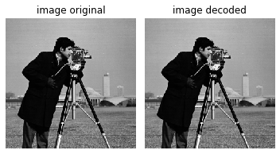

demo_huffman_compression.py  

This demo shows how to do Huffman encoding/decoding of 2D single-channel images (image/demo_huffman_compression.py) and text (text/demo_huffman_compression.py)  

**Dummy dataset (image):** 
256 x 256 8-bit image  
(left) Original image, (right) decoded image  

  

**Result:**  
image/sample_image_huffman_lookup_table.txt  

Entropy of the source:  6.88223 [bits per symbol]  
Codeword average length:  6.91743 [bits per symbol]  
Efficiency [%] :  99.49103  

Size of the original file: 65536 [bytes]  
Size of the encoded file: 56669 [bytes]  
Compression ratio:  1.15647  

SUCCESS. The original and decoded versions are identical!  

**Dummy dataset (text):** 
Original text:  
"Oranje provisional roster for Euro 2021 announced\n\nDutch men's national football coach Frank de Boer announced the country's 34-man provisional squad for the UEFA EURO 2020 football tournament taking place from June 11 to July 11. The final roster for the European championship, consisting of 26 players, will be announced on May 26th, the Dutch football association KNVB announced.\n"  

Encoded text:  
11110001001110011110111100000010111010110000110001111011010101100001
01010001110100110111110001100010000010001010011110001010000011110111
11111000100110001100111010111110011101011000110100111101110000100011
11010100010101111001111110111111111101111000101001010001101110011001
01011110111101001000011011101001010010101000111010011011111000101000
00001001111100100110111101111101010000010011010001101110111101010011
10011110001001011001111001011100010011000010100111101001111011100001
00011110101000101011110110010001101010111010100000100011110010000111
11110111110100100001101111000011111001101111001110110011001111011010
11000011000111101101010110000101010001110100110111110100001111001001
00011001011110110001010000011110010001101010111000100001111111111101
01111100101110111111100100001111110101111000111001110101111100111010
11111011000101000000010011111001001101111011111001000001000100111110
10010110010101111001001100100100100100101010111100010001110101100101
11100110100010111000101001100001100111010110110100011110010111001100
00110001100100000110101101101000110111111110111001100001100010110111
11011111101101101010111000101101011110100110111110001100010000010001
01001111000101000001111001000110101011101111111100010011000101100010
11001111011010100011011001011001101100101010001110100000110110101101
10010110101101010000011101000010101100000100101011110001000111000000
10111001110101110001101011001011110011111101010100111000010110101101
11111000101011011110111110111110001011101001111011100001000111101010
00101011110110000111011011111100110011111101110011101011100001000110
11011010110010001101010111011110111100010100101000110111000101000000
01001111100100110111101111101001100001000000010100101011001010010101
00011101100111001100111001110111001000100111101001111011100001000111
10101000101011110101101110111111

Decoded text:  
"Oranje provisional roster for Euro 2021 announced\n\nDutch men's national football coach Frank de Boer announced the country's 34-man provisional squad for the UEFA EURO 2020 football tournament taking place from June 11 to July 11. The final roster for the European championship, consisting of 26 players, will be announced on May 26th, the Dutch football association KNVB announced.\n"

**Result:**  
text/sample_text_huffman_lookup_table.txt  

Entropy of the source:  4.66382 [bits per symbol]  
Codeword average length:  4.69974 [bits per symbol]  
Efficiency [%] :  99.23570  

Size of the original file: 383 [bytes]  
Size of the encoded file: 227 [bytes]  
Compression ratio:  1.68722  

SUCCESS. The original and decoded versions are identical!  
